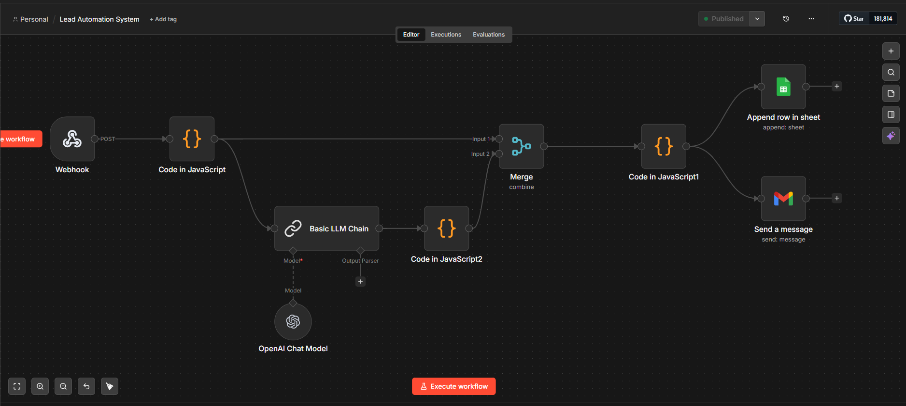
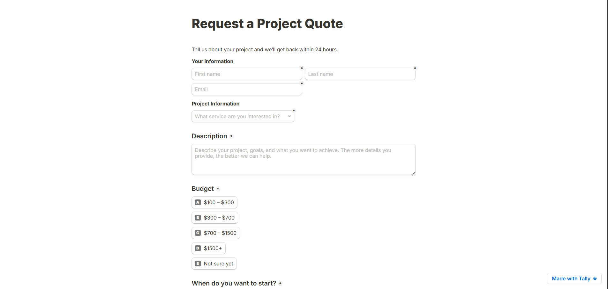

# 🚀 AI Lead Automation System

An end-to-end automation workflow built using **n8n + OpenAI + Google Sheets + Gmail** that captures leads, qualifies them using AI, stores them, and sends automated responses.

---

## ✨ Overview

This project demonstrates how to build a **real-world AI-powered business automation system**.

🔹 Capture leads from a form (Tally / Webhook)
🔹 Clean and structure the data
🔹 Analyze leads using AI (OpenAI)
🔹 Store leads in Google Sheets
🔹 Automatically send personalized email responses

---

## 🧠 Architecture

```
Form Submission
      ↓
Webhook (n8n)
      ↓
Data Cleanup (Code Node)
      ↓
AI Lead Qualification (OpenAI)
      ↓
Parse AI Output
      ↓
Merge Lead + AI Data
      ↓
Store in Google Sheets
      ↓
Send Email via Gmail
```

---

## 📸 Workflow Preview

### 🔹 AI Automation Pipeline (n8n Workflow)



---

### 🔹 Lead Capture Form (Frontend)



---

## 🛠️ Tech Stack

* ⚙️ **n8n** – Workflow automation
* 🤖 **OpenAI API** – AI lead qualification
* 📊 **Google Sheets** – Data storage
* 📧 **Gmail API** – Automated replies
* 📝 **Tally Forms / Webhook** – Lead input

---

## 🔥 Features

* ✅ Automatic lead capture
* ✅ AI-based lead scoring (Quality, Priority, Intent)
* ✅ Smart summaries and next-step recommendations
* ✅ Structured data storage
* ✅ Auto email replies
* ✅ Fully customizable workflow

---

## 📂 Project Structure

```
ai-lead-automation-system/
├── README.md
├── workflow/
│   └── lead-automation-sanitized.json
├── samples/
│   ├── sample-payload.json
│   ├── input-example.json
│   ├── ai-output-example.json
│   └── merged-output-example.json
├── docs/
│   ├── architecture.png
│   ├── screenshot-ai-pipeline.json
│   └── screenshot-form.png
├── .env.example
└── .gitignore
```

---

## 📥 Sample Input

```json
{
  "firstName": "John",
  "lastName": "Doe",
  "email": "client@example.com",
  "service": "AI Automation",
  "budget": "$300 – $700",
  "timeline": "ASAP",
  "description": "I need automation for my business"
}
```

---

## 🤖 AI Output Example

```json
{
  "leadQuality": "Medium",
  "priority": "High",
  "intent": "Serious",
  "summary": "Client needs automation with clear budget and urgency.",
  "recommendedAction": "Ask for detailed requirements and propose solution.",
  "replyTone": "Professional and friendly"
}
```

---

## 📊 Final Stored Data

```json
{
  "timestamp": "2026-03-31T12:00:00Z",
  "firstName": "John",
  "email": "client@example.com",
  "service": "AI Automation",
  "leadQuality": "Medium",
  "priority": "High"
}
```

---

## ⚙️ Setup Instructions

### 1. Import Workflow

* Open n8n
* Import `lead-automation-sanitized.json`

### 2. Configure Credentials

Set up:

* OpenAI API key
* Gmail OAuth
* Google Sheets OAuth

### 3. Create Google Sheet

Columns:

```
timestamp
firstName
lastName
email
service
budget
timeline
description
leadQuality
priority
intent
summary
recommendedAction
replyTone
```

### 4. Connect Webhook

* Use webhook URL in your form (Tally)

### 5. Test Workflow

* Submit test data
* Verify:

  * Google Sheet entry
  * Email sent

---

## 🔐 Security Note

This repository is **sanitized**.

❌ No API keys
❌ No OAuth tokens
❌ No private URLs
❌ No personal data

---

## 💡 Use Cases

* Freelancers (Fiverr / Upwork)
* Agencies
* SaaS lead capture
* Marketing automation
* CRM pre-processing

---

## 💰 Monetization Idea

You can sell this as:

* "AI Lead Automation System"
* "n8n AI Workflow Setup"
* "Automated Client Response System"

---

## 🚀 Future Improvements

* AI-generated full email replies
* CRM integration (Notion / Airtable / HubSpot)
* Slack / Telegram notifications
* Lead scoring filters
* Follow-up automation

---

## 👨‍💻 Author

**Gihan CHathuranga**

---

## ⭐ If you like this project

Give it a ⭐ on GitHub and feel free to fork it!
